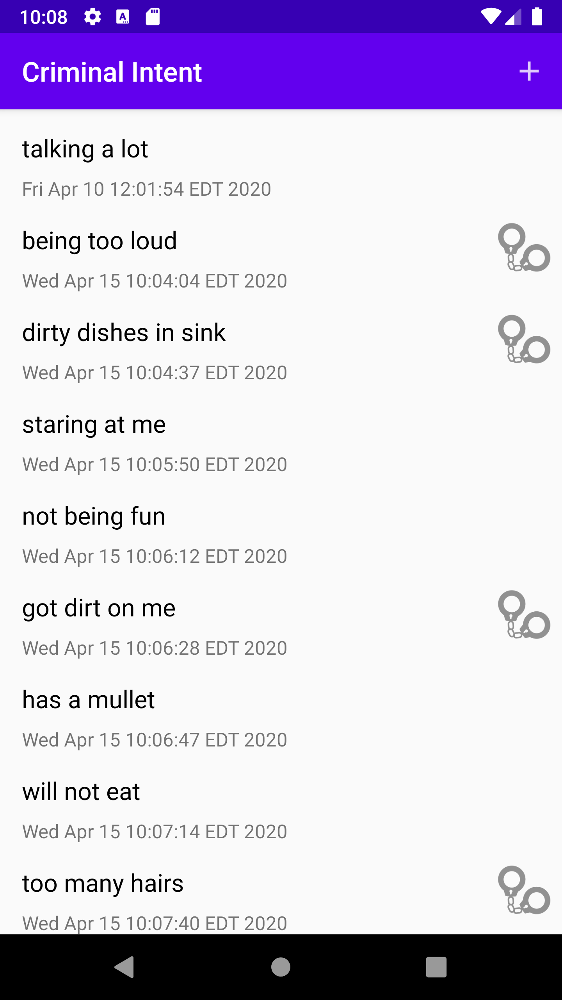
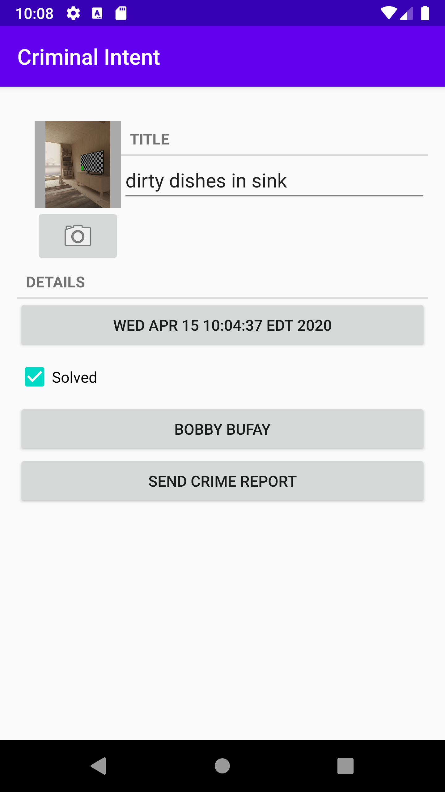

# Criminal Intent

- A Kotlin app that records crimes around the office.
- This app uses a fragmented list-detail view.

### Concepts:

- Fragments
- MVC
- Jetpack Library
- Room
- Repository
- ViewModelFactory
- TypeConverter
- RecyclerView
- LiveData
- Lifecycle Observer
- Accessibility

### Images:

  

